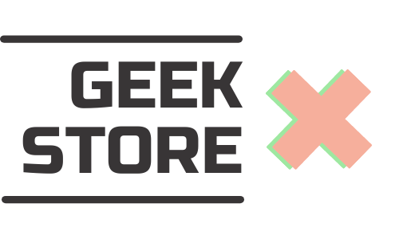

# Geek Store 🎮 

Geek Store es un sitio web de ecommerce “business to consumer” dedicado a la venta de productos de merchandising de series, películas, videojuegos y lo que refiera al mundo geek. 

## Sobre nuestra propuesta 📖

Esperamos impactar en el mercado desde la calidad y originalidad con objetos dignos de colección.
Para reforzar la idea de colección ponemos énfasis en el packaging que acompañen los diseños que ofrecemos. Con un eficiente circuito de distribución, esperamos también que nuestros  precios sean  altamente competitivos para este segmento de mercado.

## ¿A qué público estamos orientados? 👩 👨

Nos orientamos en especial al público adolescentes y jóvenes adultos, así como a pequeñas  y medianas empresas. Somos una compañía incluyente y empática con la diversidad y gustos de la  población. La novedad y la estética geek son nuestras metas.

## Autores ✒️

_Participantes del proyecto durante el desarollo del sitio:_

* **Lucía Hobrecht** - *Diseño Gráfico / Full-stack developer* - Técnica en Comunicación Audiovisual, amante de los gatos y una buena peli 🎥 [luhobrecht](https://github.com/luhobrecht)

* **Maximiliano Mosquera** - *Administración de Empresas / Full-stack developer* - [mmosquera](https://github.com/mmosquera)

## Sitios de Referencia 📝

* https://www.normacomics.com - Nos basamos en parte de su estructura y organización de los elementos
* https://frikily.com - Está relacionada con el tema que estamos tratando
* https://www.mercadolibre.com.ar/ - Sacamos ideas de su estructura también
* https://www.lacasadelfriki.es/  - Sacamos ideas de  su estructura para una mejor idea sobre la organización de nuestro proyecto.
* https://www.amazon.es - Se sacan ideas generales de la estructura de la pagina para la creación de nuestro proyecto